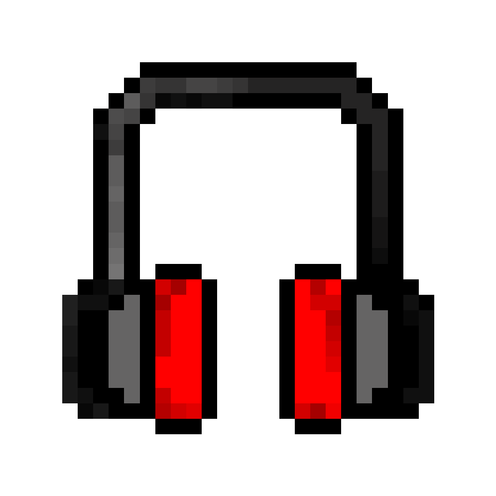
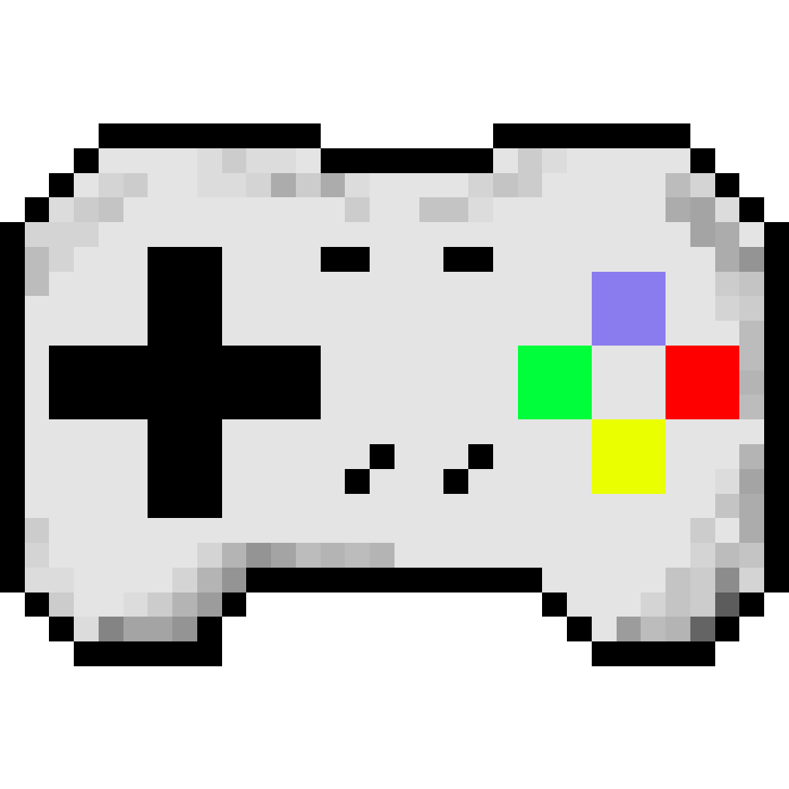
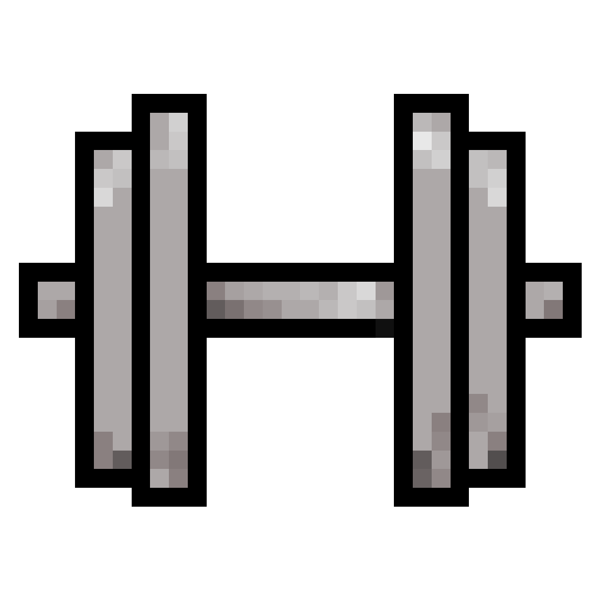
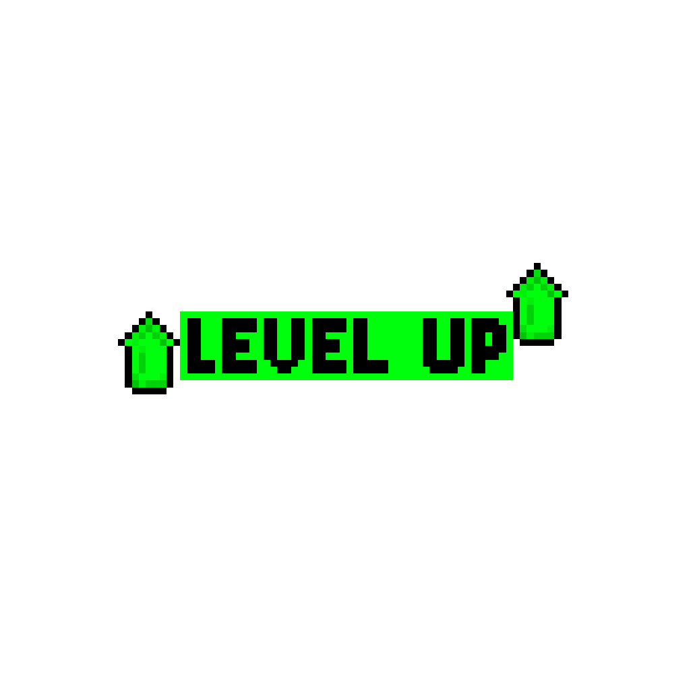

# 🎮🏋️ Gym Gamer  
**Level up your fitness like a true gamer.**  
Gym Gamer is a pixel-themed workout companion built for gamers who hit the gym. With achievements, quests, and retro-inspired visuals, this app turns your fitness journey into a game — making workouts as rewarding as boss battles.

[](client/assets/HeadphonePixel.png)

## 🎯 Core Features  
- **🎯 Quests & Goals**  
  Set custom workout goals that feel like in-game objectives.  
- **🏆 Achievements System**  
  Unlock and get rewarded as you crush milestones along with a weekly reset.  
- **📈 Progress Tracking**  
  Track your weight, reps, and strength gains with visual feedback.  
- **🔁 Workout Splits**  
  Organize your routines into repeatable splits just like leveling paths.  

[](client/assets/ControllerPixel.png)

## 🛠️ Prerequisites  
Make sure you have the following installed before running the project:

- [Node.js](https://nodejs.org/en) (v14+ recommended)  
- [npm](https://www.npmjs.com/) (v6+ recommended)  
- [Expo CLI](https://docs.expo.dev/get-started/installation/) (for mobile app development)

[](client/assets/DumbbellPixel.png)

## 🚀 Getting Started  

### Clone the Repository
```bash
git clone https://github.com/ryanmarando/gym-gamer.git
cd gym-gamer
```
### Install Dependencies:
Navigate to the project directories and install the necessary packages:
```
# For the API
cd api
npm install

# For the App
cd client
npm install
```
## Configuration
### API Configuration:
1. Create a  `.env` file in the `api` directory.
2. Update the environment variables as needed, such as setting the port number, a postgres URL connection, and other API keys.

### Application Configuration:
1. Create a  `.env` file in the `client` directory.
2. Configure the environment variables, including the API endpoint.

## Usage
### Start the API Server:
```
cd app
npm run build
npm run start
```
The API server should now be running, ready to handle requests.

### Start the Application:
```
cd client
npm start
```
The application will launch in Expo Go, allowing you to interact with the backend.

## Acknowledgements
Ryan Marando for developing this project.
For more information, visit the [project repository](https://github.com/ryanmarando/gym-gamer).

[](client/assets/LevelUpPixel.png)
